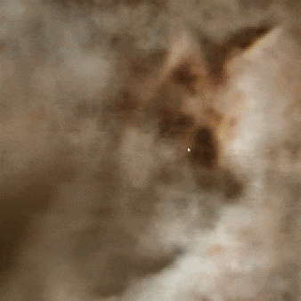
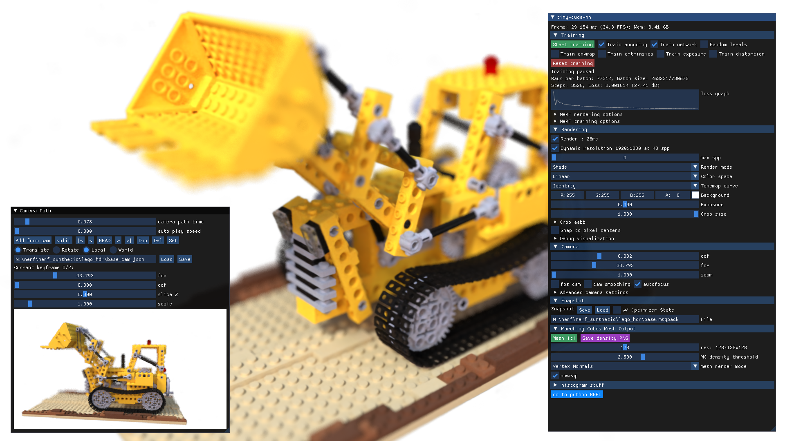
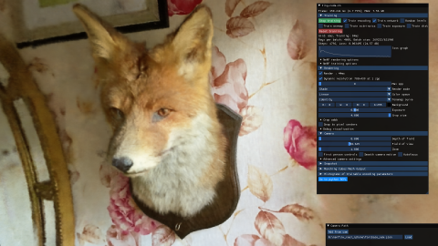
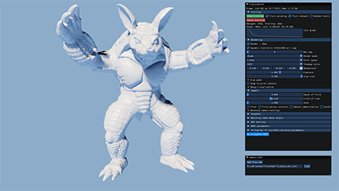
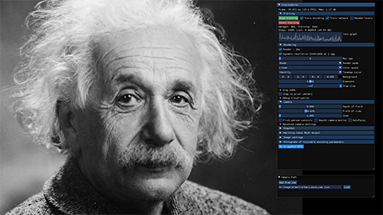
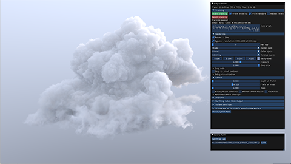

# Instant Neural Graphics Primitives 

 

Ever wanted to train a NeRF model of a fox in under 5 seconds? Or fly around a scene captured from photos of a factory robot? Of course you have!

Here you will find an implementation of four __neural graphics primitives__, being neural radiance fields (NeRF), signed distance functions (SDFs), neural images, and neural volumes.
In each case, we train and render a MLP with multiresolution hash input encoding using the [__tiny-cuda-nn__](https://github.com/NVlabs/tiny-cuda-nn) framework.

> __Instant Neural Graphics Primitives with a Multiresolution Hash Encoding__  
> [Thomas Müller](https://tom94.net), [Alex Evans](https://research.nvidia.com/person/alex-evans), [Christoph Schied](https://research.nvidia.com/person/christoph-schied), [Alexander Keller](https://research.nvidia.com/person/alex-keller)  
> _ACM Transactions on Graphics (__SIGGRAPH__), July 2022_  
> __[Project page](https://nvlabs.github.io/instant-ngp)&nbsp;/ [Paper](https://nvlabs.github.io/instant-ngp/assets/mueller2022instant.pdf)&nbsp;/ [Video](https://nvlabs.github.io/instant-ngp/assets/mueller2022instant.mp4)&nbsp;/ [Presentation](https://tom94.net/data/publications/mueller22instant/mueller22instant-gtc.mp4)&nbsp;/ [Real-Time Live](https://tom94.net/data/publications/mueller22instant/mueller22instant-rtl.mp4)&nbsp;/ [BibTeX](https://nvlabs.github.io/instant-ngp/assets/mueller2022instant.bib)__

For business inquiries, please submit the [NVIDIA research licensing form](https://www.nvidia.com/en-us/research/inquiries/).


## Installation

If you have Windows, download one of the following releases corresponding to your graphics card and extract it. Then, start `instant-ngp.exe`.

- [**RTX 3000 & 4000 series, RTX A4000&ndash;A6000**, and other Ampere & Ada cards](https://github.com/NVlabs/instant-ngp/releases/download/continuous/Instant-NGP-for-RTX-3000-and-4000.zip)
- [**RTX 2000 series, Titan RTX, Quadro RTX 4000&ndash;8000**, and other Turing cards](https://github.com/NVlabs/instant-ngp/releases/download/continuous/Instant-NGP-for-RTX-2000.zip)
- [**GTX 1000 series, Titan Xp, Quadro P1000&ndash;P6000**, and other Pascal cards](https://github.com/NVlabs/instant-ngp/releases/download/continuous/Instant-NGP-for-GTX-1000.zip)

Keep reading for a guided tour of the application or, if you are interested in creating your own NeRF, watch [the video tutorial](https://www.youtube.com/watch?v=3TWxO1PftMc) or read the [written instructions](docs/nerf_dataset_tips.md).

If you use Linux, or want the [developer Python bindings](https://github.com/NVlabs/instant-ngp#python-bindings), or if your GPU is not listed above (e.g. Hopper, Volta, or Maxwell generations), you need to [build __instant-ngp__ yourself](https://github.com/NVlabs/instant-ngp#building-instant-ngp-windows--linux).


## Usage



__instant-ngp__ comes with an interactive GUI that includes many features:
- [comprehensive controls](https://github.com/NVlabs/instant-ngp#keyboard-shortcuts-and-recommended-controls) for interactively exploring neural graphics primitives,
- [VR mode](https://github.com/NVlabs/instant-ngp#vr-controls) for viewing neural graphics primitives through a virtual-reality headset,
- saving and loading "snapshots" so you can share your graphics primitives on the internet,
- a camera path editor to create videos,
- `NeRF->Mesh` and `SDF->Mesh` conversion,
- camera pose and lens optimization,
- and many more.


### NeRF fox

Simply start `instant-ngp` and drag the `data/nerf/fox` folder into the window. Or, alternatively, use the command line:

```sh
instant-ngp$ ./instant-ngp data/nerf/fox
```



You can use __any__ NeRF-compatible dataset, e.g. from [original NeRF](https://drive.google.com/drive/folders/1JDdLGDruGNXWnM1eqY1FNL9PlStjaKWi), the [SILVR dataset](https://github.com/IDLabMedia/large-lightfields-dataset), or the [DroneDeploy dataset](https://github.com/nickponline/dd-nerf-dataset). **To create your own NeRF, watch [the video tutorial](https://www.youtube.com/watch?v=3TWxO1PftMc) or read the [written instructions](docs/nerf_dataset_tips.md).**

### SDF armadillo

Drag `data/sdf/armadillo.obj` into the window or use the command:

```sh
instant-ngp$ ./instant-ngp data/sdf/armadillo.obj
```



### Image of Einstein

Drag `data/image/albert.exr` into the window or use the command:

```sh
instant-ngp$ ./instant-ngp data/image/albert.exr
```



To reproduce the gigapixel results, download, for example, [the Tokyo image](https://www.flickr.com/photos/trevor_dobson_inefekt69/29314390837) and convert it to `.bin` using the `scripts/convert_image.py` script. This custom format improves compatibility and loading speed when resolution is high. Now you can run:

```sh
instant-ngp$ ./instant-ngp data/image/tokyo.bin
```


### Volume renderer

Download the [nanovdb volume for the Disney cloud](https://drive.google.com/drive/folders/1SuycSAOSG64k2KLV7oWgyNWyCvZAkafK?usp=sharing), which is derived [from here](https://disneyanimation.com/data-sets/?drawer=/resources/clouds/) ([CC BY-SA 3.0](https://media.disneyanimation.com/uploads/production/data_set_asset/6/asset/License_Cloud.pdf)). Then drag `wdas_cloud_quarter.nvdb` into the window or use the command:

```sh
instant-ngp$ ./instant-ngp wdas_cloud_quarter.nvdb
```



### Keyboard shortcuts and recommended controls

Here are the main keyboard controls for the __instant-ngp__ application.

| Key             | Meaning       |
| :-------------: | ------------- |
| WASD            | Forward / pan left / backward / pan right. |
| Spacebar / C    | Move up / down. |
| = or + / - or _ | Increase / decrease camera velocity (first person mode) or zoom in / out (third person mode). |
| E / Shift+E     | Increase / decrease exposure. |
| Tab             | Toggle menu visibility. |
| T               | Toggle training. After around two minutes training tends to settle down, so can be toggled off. |
| { }             | Go to the first/last training image camera view. |
| [ ]             | Go to the previous/next training image camera view. |
| R               | Reload network from file. |
| Shift+R         | Reset camera. |
| O               | Toggle visualization or accumulated error map. |
| G               | Toggle visualization of the ground truth. |
| M               | Toggle multi-view visualization of layers of the neural model. See the paper's video for a little more explanation. |
| , / .           | Shows the previous / next visualized layer; hit M to escape. |
| 1-8             | Switches among various render modes, with 2 being the standard one. You can see the list of render mode names in the control interface. |

There are many controls in the __instant-ngp__ GUI.
First, note that this GUI can be moved and resized, as can the "Camera path" GUI (which first must be expanded to be used).

Recommended user controls in __instant-ngp__ are:

* __Snapshot:__ use "Save" to save the trained NeRF, "Load" to reload.
* __Rendering -> DLSS:__ toggling this on and setting "DLSS sharpening" to 1.0 can often improve rendering quality.
* __Rendering -> Crop size:__ trim back the surrounding environment to focus on the model. "Crop aabb" lets you move the center of the volume of interest and fine tune. See more about this feature in [our NeRF training & dataset tips](https://github.com/NVlabs/instant-ngp/blob/master/docs/nerf_dataset_tips.md).

The "Camera path" GUI lets you create a camera path for rendering a video.
The button "Add from cam" inserts keyframes from the current perspective.
Then, you can render a video `.mp4` of your camera path or export the keyframes to a `.json` file.
There is a bit more information about the GUI [in this post](https://developer.nvidia.com/blog/getting-started-with-nvidia-instant-nerfs/) and [in this video guide to creating your own video](https://www.youtube.com/watch?v=3TWxO1PftMc).


### VR controls

To view the neural graphics primitive in VR, first start your VR runtime. This will most likely be either
- __OculusVR__ if you have an Oculus Rift or Meta Quest (with link cable) headset, and
- __SteamVR__ if you have another headset.
- Any OpenXR-compatible runtime will work.

Then, press the __Connect to VR/AR headset__ button in the __instant-ngp__ GUI and put on your headset.
Before entering VR, we **strongly** recommend that you first finish training (press "Stop training") or load a pre-trained snapshot for maximum performance.

In VR, you have the following controls.

| Control                | Meaning       |
| :--------------------: | ------------- |
| Left stick / trackpad  | Move |
| Right stick / trackpad | Turn camera |
| Press stick / trackpad | Erase NeRF around the hand |
| Grab (one-handed)      | Drag neural graphics primitive |
| Grab (two-handed)      | Rotate and zoom (like pinch-to-zoom on a smartphone) |


## Building instant-ngp (Windows & Linux)

### Requirements

- An __NVIDIA GPU__; tensor cores increase performance when available. All shown results come from an RTX 3090.
- A __C++14__ capable compiler. The following choices are recommended and have been tested:
  - __Windows:__ Visual Studio 2019 or 2022
  - __Linux:__ GCC/G++ 8 or higher
- A recent version of __[CUDA](https://developer.nvidia.com/cuda-toolkit)__. The following choices are recommended and have been tested:
  - __Windows:__ CUDA 11.5 or higher
  - __Linux:__ CUDA 10.2 or higher
- __[CMake](https://cmake.org/) v3.21 or higher__.
- __(optional) [Python](https://www.python.org/) 3.7 or higher__ for interactive bindings. Also, run `pip install -r requirements.txt`.
- __(optional) [OptiX](https://developer.nvidia.com/optix) 7.6 or higher__ for faster mesh SDF training.
- __(optional) [Vulkan SDK](https://vulkan.lunarg.com/)__ for DLSS support.


If you are using Debian based Linux distribution, install the following packages
```sh
sudo apt-get install build-essential git python3-dev python3-pip libopenexr-dev libxi-dev \
                     libglfw3-dev libglew-dev libomp-dev libxinerama-dev libxcursor-dev
```

Alternatively, if you are using Arch or Arch derivatives, install the following packages
```sh
sudo pacman -S cuda base-devel cmake openexr libxi glfw openmp libxinerama libxcursor
```

We also recommend installing [CUDA](https://developer.nvidia.com/cuda-toolkit) and [OptiX](https://developer.nvidia.com/optix) in `/usr/local/` and adding the CUDA installation to your PATH.

For example, if you have CUDA 11.4, add the following to your `~/.bashrc`
```sh
export PATH="/usr/local/cuda-11.4/bin:$PATH"
export LD_LIBRARY_PATH="/usr/local/cuda-11.4/lib64:$LD_LIBRARY_PATH"
```


### Compilation

Begin by cloning this repository and all its submodules using the following command:
```sh
$ git clone --recursive https://github.com/nvlabs/instant-ngp
$ cd instant-ngp
```

Then, use CMake to build the project: (on Windows, this must be in a [developer command prompt](https://docs.microsoft.com/en-us/cpp/build/building-on-the-command-line?view=msvc-160#developer_command_prompt))
```sh
instant-ngp$ cmake . -B build
instant-ngp$ cmake --build build --config RelWithDebInfo -j
```

If compilation fails inexplicably or takes longer than an hour, you might be running out of memory. Try running the above command without `-j` in that case.
If this does not help, please consult [this list of possible fixes](https://github.com/NVlabs/instant-ngp#troubleshooting-compile-errors) before opening an issue.

If the build succeeds, you can now run the code via the `./instant-ngp` executable or the `scripts/run.py` script described below.

If automatic GPU architecture detection fails, (as can happen if you have multiple GPUs installed), set the `TCNN_CUDA_ARCHITECTURES` environment variable for the GPU you would like to use. The following table lists the values for common GPUs. If your GPU is not listed, consult [this exhaustive list](https://developer.nvidia.com/cuda-gpus).

| H100 | 40X0 | 30X0 | A100 | 20X0 | TITAN V / V100 | 10X0 / TITAN Xp | 9X0 | K80 |
|:----:|:----:|:----:|:----:|:----:|:--------------:|:---------------:|:---:|:---:|
|   90 |   89 |   86 |   80 |   75 |             70 |              61 |  52 |  37 |


## Python bindings

After you have built __instant-ngp__, you can use its Python bindings to conduct controlled experiments in an automated fashion.
All features from the interactive GUI (and more!) have Python bindings that can be easily instrumented.
For an example of how the `./instant-ngp` application can be implemented and extended from within Python, see `./scripts/run.py`, which supports a superset of the command line arguments that `./instant-ngp` does.

If you would rather build new models from the hash encoding and fast neural networks, consider [__tiny-cuda-nn__'s PyTorch extension](https://github.com/nvlabs/tiny-cuda-nn#pytorch-extension).

Happy hacking!


## Additional resources

- [Getting started with NVIDIA Instant NeRF blog post](https://developer.nvidia.com/blog/getting-started-with-nvidia-instant-nerfs/)
- [SIGGRAPH tutorial for advanced NeRF dataset creation](https://www.nvidia.com/en-us/on-demand/session/siggraph2022-sigg22-s-16/).


## Frequently asked questions (FAQ)

__Q:__ The NeRF reconstruction of my custom dataset looks bad; what can I do?

__A:__ There could be multiple issues:
- COLMAP might have been unable to reconstruct camera poses.
- There might have been movement or blur during capture. Don't treat capture as an artistic task; treat it as photogrammetry. You want _\*as little blur as possible\*_ in your dataset (motion, defocus, or otherwise) and all objects must be _\*static\*_ during the entire capture. Bonus points if you are using a wide-angle lens (iPhone wide angle works well), because it covers more space than narrow lenses.
- The dataset parameters (in particular `aabb_scale`) might have been tuned suboptimally. We recommend starting with `aabb_scale=128` and then increasing or decreasing it by factors of two until you get optimal quality.
- Carefully read [our NeRF training & dataset tips](https://github.com/NVlabs/instant-ngp/blob/master/docs/nerf_dataset_tips.md).

##
__Q:__ How can I save the trained model and load it again later?

__A:__ Two options:
1. Use the GUI's "Snapshot" section.
2. Use the Python bindings `load_snapshot` / `save_snapshot` (see `scripts/run.py` for example usage).

##
__Q:__ Can this codebase use multiple GPUs at the same time?

__A:__ Only for VR rendering, in which case one GPU is used per eye. Otherwise, no. To select a specific GPU to run on, use the [CUDA_VISIBLE_DEVICES](https://stackoverflow.com/questions/39649102/how-do-i-select-which-gpu-to-run-a-job-on) environment variable. To optimize the _compilation_ for that specific GPU use the [TCNN_CUDA_ARCHITECTURES](https://github.com/NVlabs/instant-ngp#compilation-windows--linux) environment variable.

##
__Q:__ How can I run __instant-ngp__ in headless mode?

__A:__ Use `./instant-ngp --no-gui` or `python scripts/run.py`. You can also compile without GUI via `cmake -DNGP_BUILD_WITH_GUI=off ...`

##
__Q:__ Does this codebase run on [Google Colab](https://colab.research.google.com/)?

__A:__ Yes. See [this example](./notebooks/instant_ngp.ipynb) inspired on the notebook created by user [@myagues](https://github.com/NVlabs/instant-ngp/issues/6#issuecomment-1016397579). Caveat: this codebase requires large amounts of GPU RAM and might not fit on your assigned GPU. It will also run slower on older GPUs.

##
__Q:__ Is there a [Docker container](https://www.docker.com/)?

__A:__ Yes. We bundle a [Visual Studio Code development container](https://code.visualstudio.com/docs/remote/containers), the `.devcontainer/Dockerfile` of which you can also use stand-alone. 

If you want to run the container without using VSCode:
```
docker-compose -f .devcontainer/docker-compose.yml build instant-ngp
xhost local:root
docker-compose -f .devcontainer/docker-compose.yml run instant-ngp /bin/bash
```
Then run the build commands above as normal.

##
__Q:__ How can I edit and train the underlying hash encoding or neural network on a new task?

__A:__ Use [__tiny-cuda-nn__'s PyTorch extension](https://github.com/nvlabs/tiny-cuda-nn#pytorch-extension).

##
__Q:__ What is the coordinate system convention?

__A:__ See [this helpful diagram](https://github.com/NVlabs/instant-ngp/discussions/153?converting=1#discussioncomment-2187652) by user @jc211.

##
__Q:__ Why are background colors randomized during NeRF training?

__A:__ Transparency in the training data indicates a desire for transparency in the learned model. Using a solid background color, the model can minimize its loss by simply predicting that background color, rather than transparency (zero density). By randomizing the background colors, the model is _forced_ to learn zero density to let the randomized colors "shine through".

##
__Q:__ How to mask away NeRF training pixels (e.g. for dynamic object removal)?

__A:__ For any training image `xyz.*` with dynamic objects, you can provide a `dynamic_mask_xyz.png` in the same folder. This file must be in PNG format, where _non-zero_ pixel values indicate masked-away regions.

## Troubleshooting compile errors

Before investigating further, make sure all submodules are up-to-date and try compiling again.
```sh
instant-ngp$ git submodule sync --recursive
instant-ngp$ git submodule update --init --recursive
```
If __instant-ngp__ still fails to compile, update CUDA as well as your compiler to the latest versions you can install on your system. It is crucial that you update _both_, as newer CUDA versions are not always compatible with earlier compilers and vice versa.
If your problem persists, consult the following table of known issues.

**\*After each step, delete the `build` folder and let CMake regenerate it before trying again.\***

| Problem | Resolution |
|---------|------------|
| __CMake error:__ No CUDA toolset found / CUDA_ARCHITECTURES is empty for target "cmTC_0c70f" | __Windows:__ the Visual Studio CUDA integration was not installed correctly. Follow [these instructions](https://github.com/mitsuba-renderer/mitsuba2/issues/103#issuecomment-618378963) to fix the problem without re-installing CUDA. ([#18](https://github.com/NVlabs/instant-ngp/issues/18)) |
| | __Linux:__ Environment variables for your CUDA installation are probably incorrectly set. You may work around the issue using ```cmake . -B build -DCMAKE_CUDA_COMPILER=/usr/local/cuda-<your cuda version>/bin/nvcc``` ([#28](https://github.com/NVlabs/instant-ngp/issues/28)) |
| __CMake error:__ No known features for CXX compiler "MSVC" | Reinstall Visual Studio & make sure you run CMake from a developer shell. Make sure you delete the build folder before building again. ([#21](https://github.com/NVlabs/instant-ngp/issues/21)) |
| __Compile error:__ A single input file is required for a non-link phase when an outputfile is specified | Ensure there no spaces in the path to __instant-ngp__. Some build systems seem to have trouble with those. ([#39](https://github.com/NVlabs/instant-ngp/issues/39) [#198](https://github.com/NVlabs/instant-ngp/issues/198)) |
| __Compile error:__ undefined references to "cudaGraphExecUpdate" / identifier "cublasSetWorkspace" is undefined | Update your CUDA installation (which is likely 11.0) to 11.3 or higher. ([#34](https://github.com/NVlabs/instant-ngp/issues/34) [#41](https://github.com/NVlabs/instant-ngp/issues/41) [#42](https://github.com/NVlabs/instant-ngp/issues/42)) |
| __Compile error:__ too few arguments in function call | Update submodules with the above two `git` commands. ([#37](https://github.com/NVlabs/instant-ngp/issues/37) [#52](https://github.com/NVlabs/instant-ngp/issues/52)) |
| __Python error:__ No module named 'pyngp' | It is likely that CMake did not detect your Python installation and therefore did not build `pyngp`. Check CMake logs to verify this. If `pyngp` was built in a different folder than `build`, Python will be unable to detect it and you have to supply the full path to the import statement. ([#43](https://github.com/NVlabs/instant-ngp/issues/43)) |

If you cannot find your problem in the table, try searching [the discussions board](https://github.com/NVlabs/instant-ngp/discussions) and [the issues area](https://github.com/NVlabs/instant-ngp/issues?q=is%3Aissue) for help. If you are still stuck, please [open an issue](https://github.com/NVlabs/instant-ngp/issues/new) and ask for help.

## Thanks

Many thanks to [Jonathan Tremblay](https://research.nvidia.com/person/jonathan-tremblay) and [Andrew Tao](https://developer.nvidia.com/blog/author/atao/) for testing early versions of this codebase and to Arman Toorians and Saurabh Jain for the factory robot dataset.
We also thank [Andrew Webb](https://github.com/grey-area) for noticing that one of the prime numbers in the spatial hash was not actually prime; this has been fixed since.

This project makes use of a number of awesome open source libraries, including:
* [tiny-cuda-nn](https://github.com/NVlabs/tiny-cuda-nn) for fast CUDA networks and input encodings
* [tinyexr](https://github.com/syoyo/tinyexr) for EXR format support
* [tinyobjloader](https://github.com/tinyobjloader/tinyobjloader) for OBJ format support
* [stb_image](https://github.com/nothings/stb) for PNG and JPEG support
* [Dear ImGui](https://github.com/ocornut/imgui) an excellent immediate mode GUI library
* [Eigen](https://eigen.tuxfamily.org/index.php?title=Main_Page) a C++ template library for linear algebra
* [pybind11](https://github.com/pybind/pybind11) for seamless C++ / Python interop
* and others! See the `dependencies` folder.

Many thanks to the authors of these brilliant projects!

## License and Citation

```bibtex
@article{mueller2022instant,
    author = {Thomas M\"uller and Alex Evans and Christoph Schied and Alexander Keller},
    title = {Instant Neural Graphics Primitives with a Multiresolution Hash Encoding},
    journal = {ACM Trans. Graph.},
    issue_date = {July 2022},
    volume = {41},
    number = {4},
    month = jul,
    year = {2022},
    pages = {102:1--102:15},
    articleno = {102},
    numpages = {15},
    url = {https://doi.org/10.1145/3528223.3530127},
    doi = {10.1145/3528223.3530127},
    publisher = {ACM},
    address = {New York, NY, USA},
}
```

Copyright © 2022, NVIDIA Corporation. All rights reserved.

This work is made available under the Nvidia Source Code License-NC. Click [here](LICENSE.txt) to view a copy of this license.

