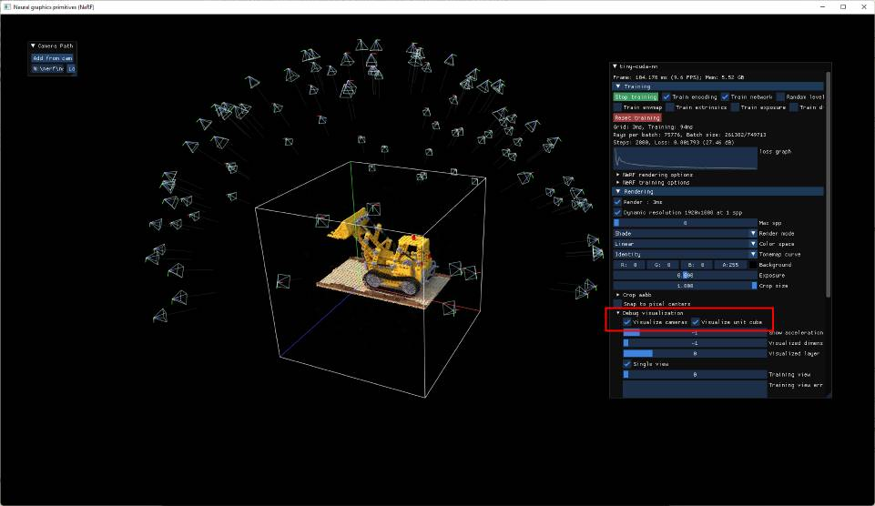
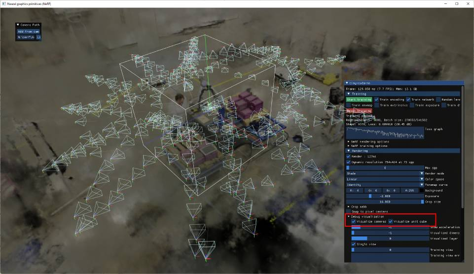

# Tips for training NeRF models with Instant Neural Graphics Primitives

Our NeRF implementation expects initial camera parameters to be provided in a `transforms.json` file in a format compatible with [the original NeRF codebase](https://www.matthewtancik.com/nerf).
We provide a script as a convenience, [scripts/colmap2nerf.py](/scripts/colmap2nerf.py), that can be used to process a video file or sequence of images, using the open source [COLMAP](https://colmap.github.io/) structure from motion software to extract the necessary camera data.

The training process can be quite picky about the dataset.
For example, it is important for the dataset to have good coverage, to not contain mislabelled camera data, and to not contain blurry frames (motion blur and defocus blur are both problematic).
This document attempts to give a few tips.
A good rule of thumb is that if your NeRF model does not seem to be converging after 20 seconds or so, it is unlikely to get much better after a long training time.
We therefore recommend adjusting the data to get clear results in the early stages of training.
For large real world scenes, it is possible to get a little bit of extra sharpness by training for a few minutes at most.
Almost all the convergence happens in the first few seconds.

The most common issue with datasets is an incorrect scale or offset in the camera positions; more details below.
The next most common issue is too few images, or images with inaccurate camera parameters (for example, if COLMAP fails).
In that case, you may need to acquire more images, or tune the process by which the camera positions are calculated.
This is outside the scope of the __instant-ngp__ implementation.

## Existing datasets

__instant-ngp__'s NeRF implementation by default only marches rays through a unit bounding box that is from `[0, 0, 0]` to `[1, 1, 1]`.
The data loader by default takes the camera transforms in the input JSON file, and scales the positions by `0.33` and offsets by `[0.5, 0.5, 0.5]` in order to map the origin of the input data to the center of this cube.
The scale factor is chosen to suit the synthetic datasets in the original NeRF paper, as well as the output of our [scripts/colmap2nerf.py](/scripts/colmap2nerf.py) script.

It is worth checking the alignment of your cameras to this bounding box by checking both "Visualize cameras" and "Visualize unit cube" in the "Debug visualization" rollup of the UI, as shown below:



For natural scenes where there is a background visible outside the unit cube, it is necessary to set the parameter `aabb_scale` in the `transforms.json` file to a power of 2 integer up to 128 (that is 1, 2, 4, 8, ..., 128), at the outermost scope (same nesting as e.g. the existing `camera_angle_x` parameter). See [data/nerf/fox/transforms.json](/data/nerf/fox/transforms.json) for an example.

The effect can be seen in the image below:



The cameras are still somewhat centered on the "object of interest" within the unit cube; however the aabb_scale parameter, here set to 16, causes the NeRF implementation to trace rays out to a larger bounding box (of side length 16) containing the background elements, centered at `[0.5, 0.5, 0.5]`.

## Scaling existing datasets

If you have an existing dataset in `transforms.json` format, it should be centered at the origin and at a similar scale to the original NeRF synthetic datasets. When you load it into NGP, if you find that it is not converging, the first thing to check is the position of the cameras relative to the unit cube, using the debug features described above. If the dataset does not fall predominantly in the unit cube, it is worth shifting it there. You can do this by adjusting the transforms themselves, or you can add global parameters to the outer scope of the json.

You can set any of the following parameters, where the listed values are the default.
```json
{
	"aabb_scale": 16,
	"scale": 0.33,
	"offset": [0.5, 0.5, 0.5],
	...	
}
```
See [nerf_loader.cu](src/nerf_loader.cu) for implementation details and additional options.

## Preparing new NeRF datasets

Make sure that you have installed [COLMAP](https://colmap.github.io/) and that both its `bin` and `lib` folder are available in your PATH. If you are using a video file as input, also be sure to install [FFmpeg](https://www.ffmpeg.org/) and make sure that it is available in your PATH.
To check that this is the case, from a terminal window, you should be able to run `colmap` and `ffmpeg -?` and see some help text from each.

If you are training from a video file, run the [scripts/colmap2nerf.py](/scripts/colmap2nerf.py) script from the folder containing the video, with the following recommended parameters:

```sh
data-folder$ python [path-to-instant-ngp]/scripts/colmap2nerf.py --video_in <filename of video> --video_fps 2 --run_colmap --aabb_scale 16
```

The above assumes a single video file as input, which then has frames extracted at the specified framerate (2). It is recommended to choose a frame rate that leads to around 50-150 images. So for a one minute video, `--video_fps 2` is ideal.

For training from images, place them in a subfolder called `images` and then use suitable options such as the ones below:

```sh
data-folder$ python [path-to-instant-ngp]/scripts/colmap2nerf.py --colmap_matcher exhaustive --run_colmap --aabb_scale 16
```

The script will run FFmpeg and/or COLMAP as needed, followed by a conversion step to the required `transforms.json` format, which will be written in the current directory. 

By default, the script invokes colmap with the "sequential matcher", which is suitable for images taken from a smoothly changing camera path, as in a video. The exhaustive matcher is more appropriate if the images are in no particular order, as shown in the image example above.
For more options, you can run the script with `--help`. For more advanced uses of COLMAP or for challenging scenes, please see the [COLMAP documentation](https://colmap.github.io/cli.html); you may need to modify the [scripts/colmap2nerf.py](/scripts/colmap2nerf.py) script itself.

The `aabb_scale` parameter is the most important `instant-ngp` specific parameter. It specifies the extent of the scene, defaulting to 1; that is, the scene is scaled such that the camera positions are at an average distance of 1 unit from the origin. For small synthetic scenes such as the original NeRF dataset, the default `aabb_scale` of 1 is ideal and leads to fastest training. The NeRF model makes the assumption that the training images can entirely be explained by a scene contained within this bounding box. However, for natural scenes where there is a background that extends beyond this bounding box, the NeRF model will struggle and may hallucinate "floaters" at the boundaries of the box. By setting `aabb_scale` to a larger power of 2 (up to a maximum of 16), the NeRF model will extend rays to a much larger bounding box. Note that this can impact training speed slightly. If in doubt, for natural scenes, start with an `aabb_scale` of 128, and subsequently reduce it if possible. The value can be directly edited in the `transforms.json` output file, without re-running the [scripts/colmap2nerf.py](/scripts/colmap2nerf.py) script.

Assuming success, you can now train your NeRF model as follows, starting in the `instant-ngp` folder:

```sh
instant-ngp$ ./build/testbed --mode nerf --scene [path to training data folder containing transforms.json]
```

### Tips for NeRF training data

The NeRF model trains best with between 50-150 images which exhibit minimal scene movement, motion blur or other blurring artefacts. The quality of reconstruction is predicated on COLMAP being able to extract accurate camera parameters from the images.
Review the earlier sections for information on how to verify this.

The `colmap2nerf.py` script assumes that the training images are all pointing approximately at a shared point of interest, which it places at the origin. This point is found by taking a weighted average of the closest points of approach between the rays through the central pixel of all pairs of training images. In practice, this means that the script works best when the training images have been captured pointing inwards towards the object of interest, although they do not need to complete a full 360 view of it. Any background visible behind the object of interest will still be reconstructed if `aabb_scale` is set to a number larger than 1, as explained above.

